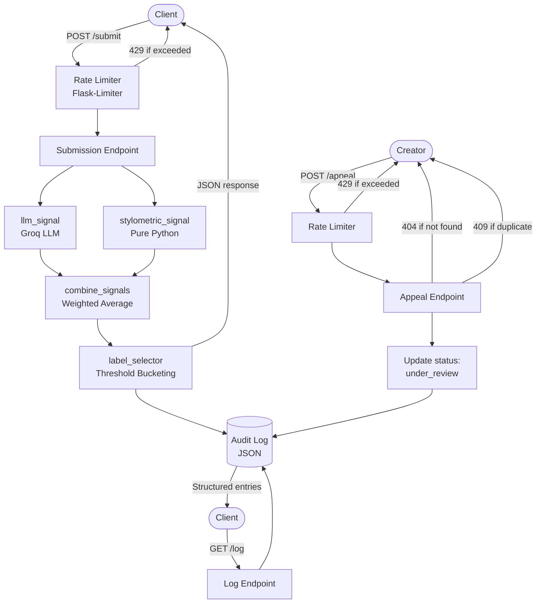

# Provenance Guard

> A backend classification system that analyzes submitted creative text and determines whether it is likely AI-generated or human-authored.

**Stack:** Flask · Groq (llama-3.3-70b-versatile) · Stylometric heuristics (pure Python) · Flask-Limiter · Structured JSON

***

## Table of Contents

- [Architecture Overview](#architecture-overview)
- [Detection Signals](#detection-signals)
- [Confidence Scoring](#confidence-scoring)
- [Transparency Labels](#transparency-labels)
- [Rate Limiting](#rate-limiting)
- [Known Limitations](#known-limitations)
- [Spec Reflection](#spec-reflection)
- [AI Usage](#ai-usage)

***

## Architecture Overview

A submission enters through the rate limiter, then fans out to both detection signals in parallel. Scores are combined via weighted average and bucketed into a transparency label. The full classification result is returned to the client and written to the audit log in a single response cycle.

Appeals bypass the detection pipeline entirely: the system validates the target `content_id`, updates its status to `under_review`, and appends an appeal entry to the log without triggering re-classification. The audit log is the single source of truth for both flows.



***

## Detection Signals

### Signal 1: LLM-Based Semantic Analysis (Groq / llama-3.3-70b-versatile)

| | |
|---|---|
| **What it measures** | Structural and semantic patterns typical of AI-generated text: uniform sentence rhythm, absence of idiosyncratic phrasing, over-coherent logical flow, and a tendency toward balanced hedging. |
| **Why it was chosen** | LLMs can evaluate deeper semantic structure that surface-level heuristics cannot capture such as coherence patterns, tonal uniformity, and implicit structural signatures of LLM output. |
| **What it misses** | Highly polished human writing (academic prose, edited literary fiction) can score suspiciously "AI-like." Also blind to stylistic mimicry if a user trains a model on their own voice. |
| **Output** | Float on a scale of `[0.0, 1.0]`. A score of `1.0` = highly confident AI. |

### Signal 2: Stylometric Heuristics (Pure Python)

| | |
|---|---|
| **What it measures** | Surface-level statistical features: type-token ratio (lexical diversity), average sentence length, punctuation density, function word frequency, and presence of common AI filler phrases (e.g., "certainly," "it's worth noting"). |
| **Why it was chosen** | Fast, fully explainable cross-check that requires no external API call. Provides an independent signal grounded in quantitative linguistics rather than LLM judgment. |
| **What it misses** | Coarse proxies only. A terse human writer may score similarly to AI. Non-native English writers may produce stylometric profiles that skew the score. |
| **Output** | Float on a scale of `[0.0, 1.0]`. A score of `1.0` = highly AI-like stylometric profile. |

***

## Confidence Scoring

Signals are combined as a weighted average:

```
confidence_score = (0.65 * llm_signal) + (0.35 * stylometric_signal)
```

The LLM signal carries higher weight because it captures deeper semantic structure; stylometrics serve as a fast, explainable cross-check.

### Score Buckets

| Score Range | Classification | Label Key |
|---|---|---|
| `0.80 – 1.00` | High-confidence AI | `AI_HIGH` |
| `0.40 – 0.79` | Uncertain | `UNCERTAIN` |
| `0.00 – 0.39` | High-confidence Human | `HUMAN_HIGH` |

### Example Submissions

**High-confidence AI example**

- **Input excerpt:** "The battle between Satoru Gojo and Ryomen Sukuna stands as one of the most epic and breathtaking confrontations in the history of anime and manga. Gojo, with his unparalleled Infinity and the awe-inspiring Six Eyes, represents the pinnacle of jujutsu sorcery in the modern era. "

- **LLM signal score:** `0.87`

- **Stylometric signal score:** `0.58`

- **Combined confidence score:** `0.76` → Label: `AI_HIGH`

- **Why this score makes sense:** The score being fairly high correlates with the tendency for AI to attribute depth to a source material without adequately showing it itself. For example, in this exercept of the LLM describing the battle between Gojo and Sukuna from JJK, (you can see the full text in test_endpoints.py) it stacks superlatives and raises questions to analyze the fight but that analysis lacks any real substance as to how this fight tangibly felt. 

**Lower-confidence / uncertain example**

- **Input excerpt:** "He was pretty extroverted as a kid and didn't care what people thought of him. And he matured as he grew to dull out those negative personality traits. And now as he has furthered matured to a point where he's actually self aware of his traits and how it may affect others, but still actively displays it. His home environment most likely and other factors such as his narcissism to crave attention. This leads to Zhen, the first person he considered to 'care about him' in this certain period of his life. But this made him to clingy and he is now in a point of denial. He's previously said that he no longer cares about Zhen but is very clear he still does. And I feel in some sort of way he's being kind of manipulative here."
- **LLM signal score:** `0.23`

- **Stylometric signal score:** `0.31`

- **Combined confidence score:** `0.26` → Label: `HUMAN_HIGH`

- **Why this score makes sense:** The contents of this text exhibited strong signals of borderline formal prose and dynamic sentence and vocabulary structure matching a human's. In this instance, "And he matured as he grew to dull out those negative personality traits. And now as he has furthered matured to a point where he's actually self aware of his traits and how it may affect others, but still actively displays it," a specific aspect of this excerpt uses "And" to begin sentence two consecutive times, an unprecedented pattern that an LLM would follow.

### Results from test_endpoints.py (Stylometric scores were rounded to the nearest hundredth):

```
Test: AI-generated text
Status: 200
LLM Signal Score: 0.87
Stylometric Signal Score: 0.5760958403234826
Confidence Score: 0.7671
Label Key: AI_HIGH
Label Text: This content was likely generated by an AI tool.
Expected: AI_HIGH
✓ PASS
```
```
Test: Human-written text
Status: 200
LLM Signal Score: 0.23
Stylometric Signal Score: 0.3051138197919069
Confidence Score: 0.2563
Label Key: HUMAN_HIGH
Label Text: This content appears to be human-written.
Expected: HUMAN_HIGH
✓ PASS
```

***

## Transparency Labels

Each label is returned in plain language intended for non-technical readers. No jargon.

### `AI_HIGH` - score `0.75–1.00`

> **"This content was likely generated by an AI tool."**
> Our system found strong signals suggesting this piece was not written by a human. The creator may appeal this decision below.

### `UNCERTAIN` - score `0.35–0.74`

> **"We're not sure who created this."**
> Our system found mixed signals as this content may be human-written, AI-generated, or a combination of both. We're flagging it for transparency, not as an accusation.

### `HUMAN_HIGH` - score `0.00–0.34`

> **"This content appears to be human-written."**
> Our system found no strong signals of LLM-generated content. Attribution looks authentic.

***

## Rate Limiting

Rate limiting is applied per IP address using Flask-Limiter's default `get_remote_address` key function. Since Provenance Guard v1 has no authentication layer, IP is the practical next-best option. The trade-off is that users behind shared NATs may be grouped under one limit, which is an acceptable simplification for a small-scale  project. 

| Endpoint | Limit | Window | Reasoning |
|---|---|---|---|
| `POST /submit` | 10 requests | per minute | Each classification calls Groq, incurring latency and counting against free-tier API limits. 10/min gives a real user room to test their integration; a malicious scan burns through quickly and receives a `429`. |
| `POST /appeal` | 5 requests | per minute | Appeals are low-frequency by design. No legitimate creator needs to submit more than 5 in 60 seconds. Prevents log pollution from duplicate or bulk submissions. |
| `GET /log` | 30 requests | per minute | Read-only with no external calls. 30/min is generous enough for interactive debugging without opening a trivial DoS vector on the log file. |

When a limit is exceeded, Flask-Limiter returns `429 Too Many Requests` with a `Retry-After` header and the following body:

```json
{
  "error": "Rate limit exceeded. Try again in 60 seconds.",
  "status": 429
}
```

***
