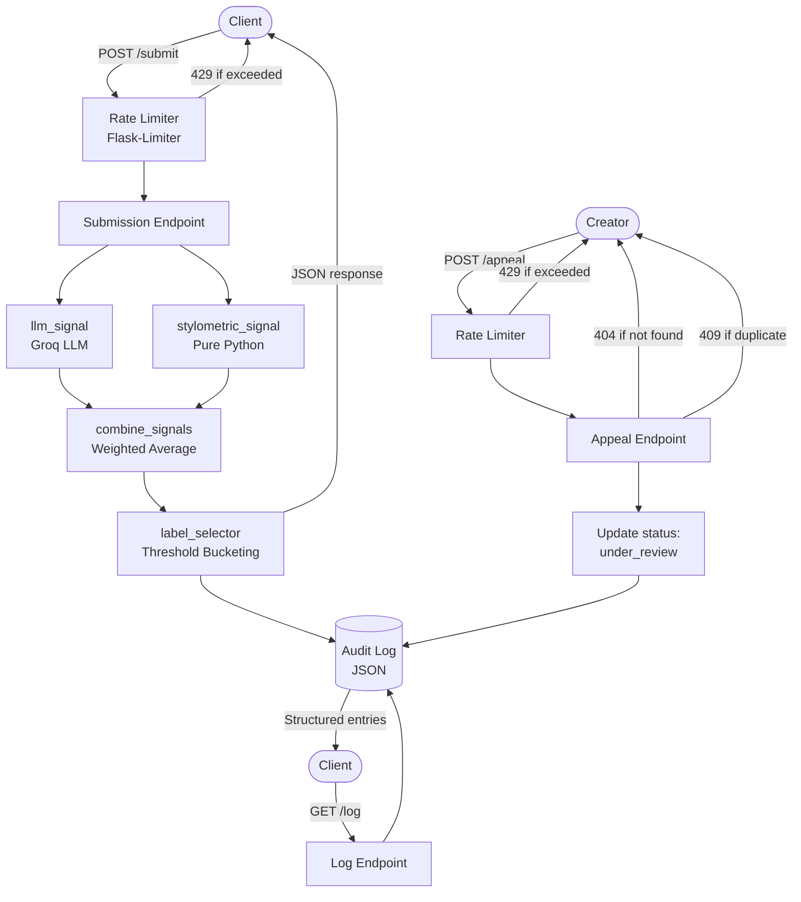

# Provenance Guard - planning.md

## Project Overview

Provenance Guard is a backend classification system that analyzes submitted creative text and determines whether it is likely AI-generated or human-authored. It returns a structured attribution result, confidence score, and a plain-language transparency label. Creators can appeal classifications, and all decisions are recorded in a structured audit log.

**Stack:** Flask · Groq (llama-3.3-70b-versatile) · Stylometric heuristics (pure Python) · Flask-Limiter · structured JSON 

***

## Rate Limiting

### Strategy

Rate limiting is applied per **IP address** using Flask-Limiter's default `get_remote_address` key function. Since Provenance Guard has no authentication layer in v1, there are no user accounts to key on and IP is the practical next best option. The trade-off is that users behind shared NATs could be unfairly grouped under one limit, but for a small-scale academic project, this is an acceptable simplification.

The algorithm used is Flask-Limiter's default **fixed window**. Essentially when a certain limit is applied, the library creates a counter keyed to the client's IP address and the specific endpoint.

### Chosen Limits

| Endpoint | Limit | Window | Reasoning |
|---|---|---|---|
| `POST /submit` | **10 requests** | per minute | The classification pipeline calls Groq. Each call has latency and counts against Groq's free-tier rate limit. 10/min gives a real user room to test their integration without hammering the LLM. A malicious scan would burn through 10 quickly and get a 429. |
| `POST /appeal` | **5 requests** | per minute | Appeals are low-frequency by design. A creator disputing a decision does not need to submit more than 5 appeals in 60 seconds. This limit prevents log pollution from duplicate or bulk submissions. |
| `GET /log` | **30 requests** | per minute | Read-only, no external calls. 30/min is generous enough for interactive debugging without opening a trivial DoS vector on the log file. |

### What Happens When the Limit Is Hit

Flask-Limiter returns a `429 Too Many Requests` response automatically. The response body will include a message like:

```json
{
  "error": "Rate limit exceeded. Try again in 60 seconds.",
  "status": 429
}
```

A `Retry-After` header will be included so the client knows exactly when to retry.

***

## Detection Signals

### Signal 1: LLM-Based Semantic Analysis (Groq w/ llama-3.3-70b-versatile)

- **What it measures:** Structural and semantic patterns typical of AI-generated text along with uniform sentence rhythm, absence of idiosyncratic phrasing, over-coherent logical flow, and a tendency toward balanced hedging.
- **What it misses:** Highly polished human writing (academic prose, edited literary fiction) can score suspiciously "AI-like." Also blind to stylistic mimicry if a user trains a model on their own voice.
- **Output:** A probability score in `[0.0, 1.0]` where 1.0 = highly confident AI.

### Signal 2: Stylometric Heuristics (Pure Python)

- **What it measures:** Surface-level statistical features of the text, type-token ratio (lexical diversity), average sentence length, punctuation density, function word frequency, and presence of common AI filler phrases (e.g., "certainly," "it's worth noting").
- **What it misses:** These are coarse proxies. A terse human writer may score similarly to AI. Non-native English writers may produce stylometric profiles that skew the score.
- **Output:** A normalized score in `[0.0, 1.0]` where 1.0 = highly AI-like stylometric profile.

### Signal Combination

Signals are combined as a **weighted average**:

```
confidence_score = (w1 * signal_1_score) + (w2 * signal_2_score)
```

Initial weights: `w1 = 0.65` (LLM signal), `w2 = 0.35` (stylometric). The LLM signal is weighted higher because it captures deeper semantic structure; stylometrics serve as a fast, explainable cross-check. Weights may be adjusted after validation testing.

***

## Confidence Scoring & Uncertainty Representation


The combined `confidence_score` is a float in `[0.0, 1.0]`. Score interpretation is bucketed into three ranges:

| Score Range | Classification | Label Variant |
|---|---|---|
| `0.80 – 1.00` | High-confidence AI | `"AI_HIGH"` |
| `0.40 – 0.79` | Uncertain | `"UNCERTAIN"` |
| `0.00 – 0.39` | High-confidence Human | `"HUMAN_HIGH"` |

**Validation approach:** At least two test submissions will be run; one clearly AI-generated passage (expected score > 0.80) and one handwritten personal essay excerpt (expected score < 0.35) in order to confirm the thresholds produce meaningfully distinct outputs before accepting them.

***
## Transparency Label Variants

Labels must be written in plain language a non-technical reader can understand. No jargon.

### `AI_HIGH` (score 0.80–1.00)
> **"This content was likely generated by an AI tool."**
> Our system found strong signals suggesting this piece was not written by a human. The creator may appeal this decision below.

### `UNCERTAIN` (score 0.40–0.79)
> **"We're not sure who created this."**
> Our system found mixed signals as this content may be human-written, AI-generated, or a combination of both. We're flagging it for transparency, not as an accusation.

### `HUMAN_HIGH` (score 0.00–0.39)
> **"This content appears to be human-written."**
> Our system found no strong signals of LLM-generated content. Attribution looks authentic.

***

## Appeals Workflow

### Workflow Steps

1. Creator submits a `POST /appeal` request with `content_id` and a `reasoning` field (free text, required).
2. System updates the content record's `status` field from `"classified"` → `"under_review"`.
3. Appeal is appended to the audit log as a new entry linked to the original `content_id`, with its own timestamp.
4. Reviewers should be able to see the content_id and reasoning of the creator's appeal through the GET /log endpoint. 

### Anticipated Edge Cases

**Edge Case 1 - Missing `reasoning` field:**
An appeal submitted without a `reasoning` value must be rejected with a `400 Bad Request` and a message like `"Appeal must include your reasoning."` The spec requires creator reasoning to be captured; empty appeals are not meaningful.

**Edge Case 2 - Appealing content that was never classified:**
If a `content_id` is submitted that does not exist in the system, the endpoint must return `404 Not Found` rather than silently creating a dangling appeal record in the log.

**Edge Case 3 - Duplicate appeals:**
If a creator submits a second appeal for the same `content_id` while status is already `"under_review"`, the system should reject it with `409 Conflict` to prevent log pollution.

***


## Architecture



A submission enters through the rate limiter, then fans out to both detection signals in parallel before scores are combined and bucketed into a transparency label. The full classification result is returned to the client and written to the audit log in a single response cycle. For appeals, they will bypasse the detection pipeline entirely: it validates the target `content_id`, updates its status to `under_review`, and appends an appeal entry to the log without triggering re-classification. The audit log is the single source of truth for both flows and every classification decision and every appeal lands there in structured form.

***

## AI Tool Plan


### M3 - Submission Endpoint + First Signal (LLM)

**When:** First implementation session, before any signal logic exists.

**Spec sections provided as input:**
- Detection Signals (Signal 1 - LLM description, output format, weight)
- Confidence Scoring & Uncertainty (threshold table, weighted average formula)
- Architecture diagram


**What I will ask the AI to generate:**
- Flask app skeleton (`app.py`) with the `POST /submit` route stubbed out
- the `llm_signal(text: str) -> float` function that includes a Groq API call, prompt structure, and JSON score extraction
- implement `combine_signals(s1: float, s2: float) -> float` using the weighted average with placeholder `s2 = 0.0` until reaching M4

**How I will verify the output:**
Run `llm_signal()` directly on three test inputs before wiring it into the endpoint: one clearly AI-generated passage (expected > 0.80), one personal essay excerpt (expected < 0.35), and one ambiguous mixed-voice text (expected 0.40–0.70). If the scores don't land in the expected zones, I'll revise the Groq prompt before proceeding.

***

### M4 - Second Signal + Full Confidence Scoring

**When:** After M3 passes manual testing.

**Spec sections provided as input:**
- Detection Signals (Signal 2 with stylometric heuristics, feature list, weight)
- Confidence Scoring & Uncertainty (threshold table, full weighted average with both signals)
- Architecture diagram 

**What I will ask the AI to generate:**
- `stylometric_signal(text: str) -> float` metrics using type-token ratio, avg sentence length, punctuation density, function word frequency, filler phrase detection, normalized to `[0.0, 1.0]`
- Updated `combine_signals()` using both signal scores at `w1=0.65`, `w2=0.35`
- `label_selector(score: float) -> str` that maps the combined score to `AI_HIGH`, `UNCERTAIN`, or `HUMAN_HIGH` using the defined thresholds


**What I will check:**
Do scores vary meaningfully between clearly AI and clearly human inputs? I'll run the same three test cases from M3 through the full pipeline and verify: 

- (1) the high-confidence AI input scores ≥ 0.80, 

- (2) the human input scores ≤ 0.39, 

- (3) the ambiguous input lands in the `UNCERTAIN` band and does not get the same label as either extreme. If two inputs produce the same label despite obviously different content, the weights need tuning before moving on.

***

### M5 - Production Layer (Labels, Appeals, Audit Log)

**When:** After M4 scoring is validated.

**Spec sections provided as input:**
- Transparency Label Variants (all three label text blocks)
- Appeals Workflow (workflow steps + edge cases)
- Audit Log schema requirements
- Architecture diagram

**What I will ask the AI to generate:**
- `format_label(label_key: str, score: float) -> dict` - returns the correct plain-language label text and variant key for the JSON response
- `POST /appeal` endpoint - validates `content_id` and `reasoning`, updates status, appends appeal entry to audit log
- `GET /log` endpoint - returns all log entries as structured JSON

**How I will verify:**
- Hit `POST /submit` with inputs that trigger each of the three label variants and confirm the returned label text matches the spec exactly.
- Submit a valid appeal and confirm: 
  1. The `GET /log` response shows `status: "under_review"`, 
  2. The appeal entry is present with `reasoning` captured, 
  3. A second appeal to the same `content_id` returns `409 Conflict`.
- What I will likely revise: AI-generated appeal endpoints often skip the duplicate-appeal guard. I'll add that manually if it's missing.

***

## Endpoint Summary

| Method | Route | Purpose |
|---|---|---|
| `POST` | `/submit` | Submit content for classification |
| `POST` | `/appeal` | Submit an appeal for a classification |
| `GET` | `/log` | Retrieve structured audit log |

***